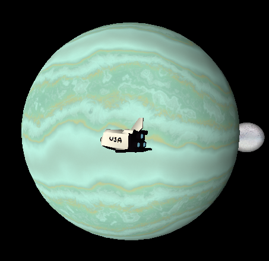

## About

I am a senior majoring in Applied Computer Science with a simulation and graphics focus at Oregon State University.
I enjoy hiking, fishing, and rock climbing
Currently working on a Augmented Reality Sandbox to aid in civil and construction engineering. 

## Projects

### AR Sandbox

A senior capstone project that enables users to interact tangibly with the terrain of an environment by physically pushing sand around in order to gain a new perspective when planning civil engineering projects, such as roads, bridges, and other construction projects. The sandbox can also simulate traffic flows and their changes if roads are blocked, showing increased traffic in other areas.
 

Currently developing additional functionality to the existing sandbox:

<ul>
    <li>Disaster relief simulations.</li>
    <li>import/export terrain data functionality to common GIS formats.</li>
    <li>ability for the system to recognize different objects placed into the existing sandbox.</li>
</ul>

## Links

### Linkdin
 <li><a href="https://www.linkedin.com/in/tyler-rivas-8b8629189/">https://www.linkedin.com/in/tyler-rivas</a></li>
    
### Github
 <li><a href="https://github.com/rivasty">https://github.com/rivasty</a></li>
